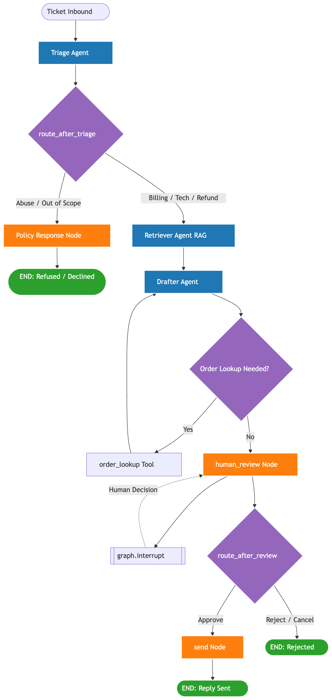

# 🛍️ ShopEasy Support Resolver — Multi-Agent AI Product

A **multi-agent customer-support system** built with **LangGraph** and **Claude
(`claude-opus-4-8`)**. Paste a customer ticket → the system **classifies** it,
**retrieves** the relevant company policy, **drafts** a grounded reply, and asks a
**human to approve** before anything is "sent". Abusive and out-of-scope messages
are stopped by a **guardrail**.

> Capstone for *Multi-Agent Orchestration [AI/ML]*. Team: **Mayank Gupta, Kumar Kartikay , Abhishek Kumar Shah**.

---

## 1. Problem & target user

Support teams drown in repetitive tickets (refunds, billing, login issues). A naive
chatbot is risky — it hallucinates policy and can send wrong refunds. Our product is
for a **support agent / team lead** who wants AI to do the heavy lifting (triage,
policy lookup, drafting) while keeping a **human in control of high-impact actions**.

It is **not a single-prompt chatbot**: it has distinct agent roles, structured
handoffs, tool use, conditional routing, retrieval grounding, guardrails, and a
human approval gate.

## 2. Why it needs multiple agents

Each step is a different job with different context and different failure modes:

- **Triage** needs to classify and route — get this wrong and everything downstream is wrong.
- **Retrieval** needs to find the *right policy* — a separate concern from writing.
- **Drafting** needs to write well *and only from grounded facts* — and call tools for order data.

Separating them gives clear responsibilities, makes each independently testable, and
lets us route differently per category (e.g. abuse never reaches the drafter).

## 3. Architecture



| Agent / node | Role | Key technique |
|---|---|---|
| **Triage** (`triage_agent`) | Classify into `billing/technical/refund/abuse/out_of_scope`, extract order ID & sentiment | **Structured output** via forced tool-use + Pydantic validation |
| **Retriever** (`retriever_agent`) | Fetch the most relevant help-doc sections | **RAG** (TF-IDF + cosine similarity over `knowledge_base/`) |
| **Drafter** (`drafter_agent`) | Write the reply grounded in retrieved policy | **Tool use** — calls `order_lookup` when an order is referenced |
| `policy_response` | Safe refusal / decline | **Guardrail** |
| `human_review` | Pause for Approve / Edit / Reject | **Human-in-the-loop** (`interrupt()`) |
| `send` | Execute the send | **High-impact action**, post-approval only, via `send_reply` tool |

**Shared state** (`src/state.py`) is a `TypedDict` passed between all nodes — how
information is stored, passed, and reused across the system.

## 4. How to run

```bash
# 1. Create the env and install deps
python3 -m venv .venv
source .venv/bin/activate
pip install -r requirements.txt

# 2. Add your Anthropic key (already done if .env exists)
echo 'ANTHROPIC_API_KEY=sk-ant-...' > .env

# (optional) turn on LangSmith tracing — see every agent + LLM call at smith.langchain.com
echo 'LANGSMITH_TRACING=true'        >> .env
echo 'LANGSMITH_API_KEY=lsv2_...'    >> .env
echo 'LANGSMITH_PROJECT=shopeasy-support' >> .env

# 3a. Run the 5-case evaluation suite
python evals.py

# 3b. Try one ticket from the command line
python -m src.run "I want a refund for order ORD-1001, it arrived broken."

# 3c. Launch the interactive demo (recommended for the presentation)
streamlit run app.py

# 3d. Open the explainer notebook (graph diagram + step-by-step + evals inline)
jupyter notebook walkthrough.ipynb
```

> **LangSmith is optional.** With no key the system runs exactly the same — tracing
> is simply off. Get a free key at https://smith.langchain.com → Settings → API Keys.

### Sample data for reviewers

The system uses a **mock order database** (`src/tools.py`) — the Drafter's `order_lookup`
tool reads it. Any **other** order ID is treated as "not found". Use these to test the
refund logic against the policy in `src/knowledge_base/refunds.md` (30-day window,
$200 manager-approval threshold, clearance = final sale):

| Order ID | Status | Item | Amount | What it demonstrates |
|----------|--------|------|-------:|----------------------|
| `ORD-1001` | delivered 5 days ago | Wireless Mouse | $49.99 | ✅ Clean refund — in window, low value |
| `ORD-1002` | delivered 45 days ago | Mechanical Keyboard | $250.00 | ❌ Outside 30-day window **and** over $200 |
| `ORD-1003` | in transit | USB-C Cable (Clearance) | $19.99 | ❌ Final-sale / clearance — not refundable |
| `ORD-1004` | delivered 10 days ago | Bluetooth Headphones | $129.00 | ✅ Clean refund — mid value, in window |
| `ORD-1005` | delivered 3 days ago | 4K Monitor | $399.00 | ⚠️ Eligible but **> $200 → needs manager approval** |
| `ORD-1006` | in transit | Laptop Stand | $75.00 | ↪︎ Not delivered yet — cancel/return, not refund |
| `ORD-1007` | delivered 60 days ago | Office Chair | $89.00 | ❌ Outside the 30-day window |
| any other (e.g. `ORD-9999`) | — | — | — | 🔎 Not found — agent asks the customer to recheck the ID |

**Example tickets to try** (these are also preset in the Streamlit dropdown):

- `I think I was charged twice for my order, can you help?` → **billing**
- `I can't log into my account, the password reset email never arrives.` → **technical**
- `I want a refund for order ORD-1001, it arrived broken.` → **refund**, approved & sent
- `Please refund order ORD-1005, the 4K monitor — I changed my mind.` → **refund**, flags > $200 approval
- `I'd like to return ORD-1003, the clearance USB-C cable.` → **refund**, declined (final sale)
- `You people are idiots, give me my money back you morons!` → **abuse**, refused by guardrail
- `What's the weather in Mumbai and can you recommend a pizza place?` → **out_of_scope**, declined

## 5. Evaluation, guardrails & observability

- **`python evals.py`** runs **5 scenarios** — one per graph branch — and asserts the
  chosen category and final status. (billing, technical, refund w/ tool-use, abuse →
  refused, out-of-scope → declined.) Current result: **5/5 pass**.
- **Guardrails:** abusive tickets are refused and never auto-sent; out-of-scope tickets
  are politely declined; the drafter is instructed to use *only* retrieved policy and to
  flag refunds > $200 for manager approval; **every** outbound reply requires human approval.
- **Observability:** two layers. (1) Every node appends to `state["log"]`; the trace is
  printed by the CLI/evals and shown live in the Streamlit UI (category, sentiment, RAG
  sources, tools used). (2) **LangSmith tracing** — when enabled, every agent node and
  every Claude call is recorded as a span at smith.langchain.com (wired in `src/llm.py`).

## 6. Repo layout

```
├── app.py                 # Streamlit demo (with the live approval gate)
├── walkthrough.ipynb      # explainer notebook: graph diagram + step-by-step + evals
├── evals.py               # 5 evaluation scenarios
├── requirements.txt
├── src/
│   ├── graph.py           # LangGraph: nodes, edges, conditional routing, checkpointer
│   ├── agents.py          # the 3 agents + guardrail + send nodes
│   ├── schemas.py         # Pydantic models for structured handoffs
│   ├── state.py           # shared graph state (TypedDict)
│   ├── rag.py             # TF-IDF retriever
│   ├── tools.py           # order_lookup + send_reply (mock) + tool schema
│   ├── llm.py             # Claude client wrapper
│   ├── run.py             # programmatic driver (used by evals + CLI)
│   └── knowledge_base/    # help docs: refunds / shipping / billing / account_technical
```

## 7. Rubric coverage

| Criterion (weight) | Where |
|---|---|
| Problem & product clarity (10%) | §1–2, real support workflow, not a chatbot |
| Multi-agent architecture (20%) | 3 specialized agents + guardrail/send nodes, clear handoffs (`src/agents.py`) |
| LangGraph implementation (15%) | `src/graph.py` — state, nodes, edges, 2 conditional routers, interrupt checkpointer |
| Tool use & integrations (10%) | `order_lookup` (tool-use loop) + `send_reply`; RAG retriever |
| State, memory, context (10%) | `src/state.py` TypedDict threaded through every node |
| Evaluation & debugging (10%) | `evals.py` 5 cases + per-node trace logs + **LangSmith traces** |
| Guardrails & human-in-the-loop (10%) | guardrail node + `interrupt()` approval gate |
| Demo quality (10%) | `streamlit run app.py`, runs end-to-end |
| Individual contribution (15%) | see §8 |

## 8. Team contributions (presentation guide)

The 3 agents map cleanly to the 3 members — each owns one agent **plus** a system concern:

- **Mayank — Triage agent + LangGraph orchestration.** `triage_agent`, structured
  output, and the whole graph wiring/state/routing (`graph.py`, `state.py`, `schemas.py`).
- **Kartikay — Retriever agent + RAG + evaluation + observability.** `retriever_agent`,
  the knowledge base, the TF-IDF retriever (`rag.py`), the 5-case eval suite, and the
  LangSmith tracing setup (`src/llm.py`) + trace logs.
- **Abhishek — Drafter agent + tools + guardrails + demo.** `drafter_agent` with
  `order_lookup` tool-use, `tools.py`, the guardrail/approval/send nodes, and the
  Streamlit UI (`app.py`).

Each member can demo their part live and explain how it connects to the full graph.

---

*YC-style inspiration: AI support assistants (e.g. Decagon, Lorikeet). Original
implementation; no customer data used — all orders and sends are mocked.*
